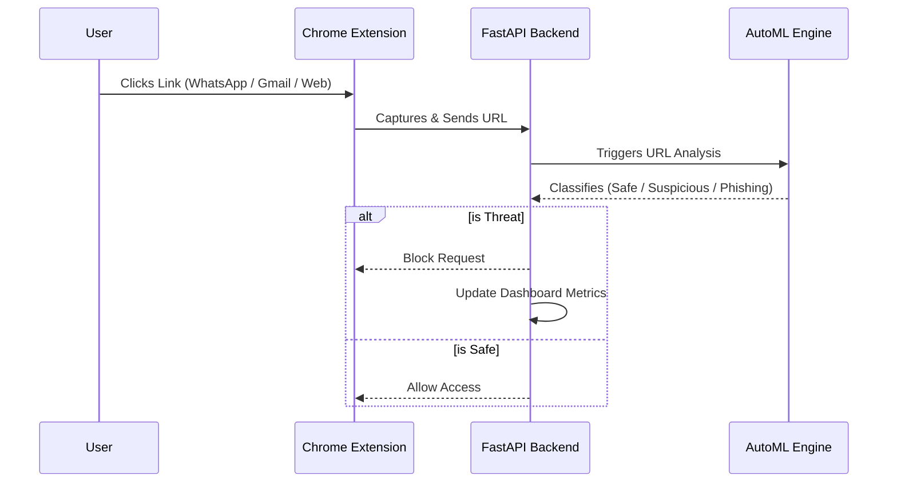
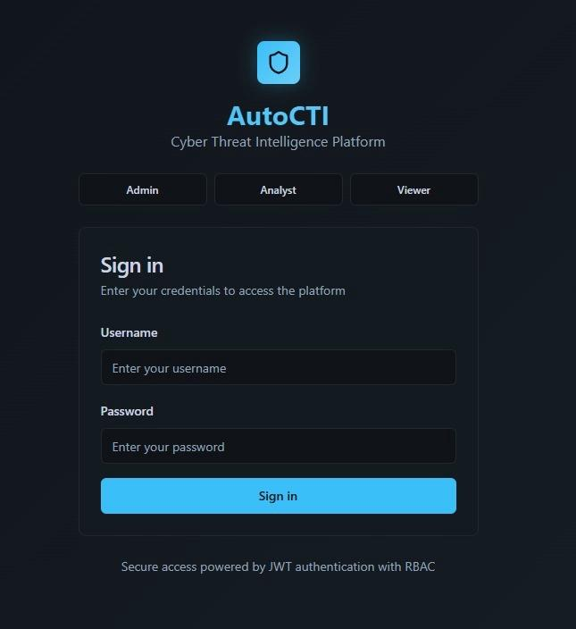
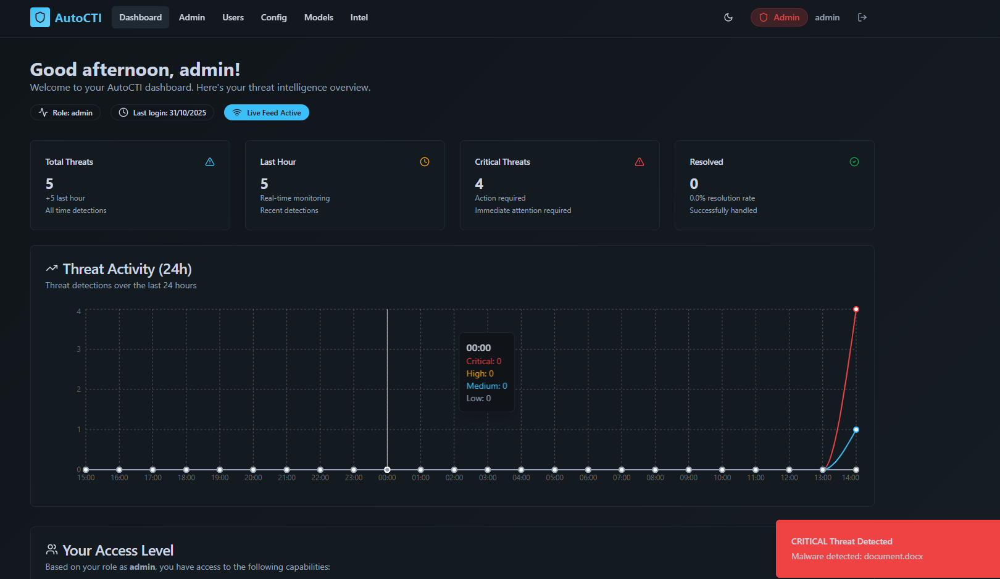

<div align="center">

# 🛡️ AutoCTI 
**Automated Cyber Threat Detection using AutoML**

> A real-time cybersecurity system that detects and blocks threats from platforms like WhatsApp, Gmail, and browsers using AutoML and a Chrome Extension.

[](https://fastapi.tiangolo.com/)
[](https://reactjs.org/)
[](https://www.python.org/)
[](https://www.automl.org/)

</div>

---

## 📖 Table of Contents
- [Overview](#-overview)
- [Key Highlights](#-key-highlights)
- [System Architecture](#-system-architecture)
- [Tech Stack](#-tech-stack)
- [Threat Intelligence](#-threat-intelligence)
- [Screenshots](#-screenshots)
- [Getting Started](#-getting-started)
- [Comparison: AutoCTI vs Antivirus](#-comparison-autocti-vs-antivirus)
- [Roadmap & Future Scope](#-roadmap--future-scope)
- [Team](#-team)

---

## ⚡ Overview

**AutoCTI** is an advanced cyber threat detection system engineered to identify malicious activities—such as phishing links, suspicious URLs, and brute-force attacks—in real time. 

With attackers increasingly leveraging platforms like WhatsApp, Gmail, and web applications to distribute malicious links, AutoCTI acts as an active shield, monitoring and neutralizing threats instantaneously. Unlike traditional signature-based antivirus solutions, AutoCTI harnesses the power of **AutoML (Automated Machine Learning)** to dynamically adapt to both known and emerging (zero-day) threats.

---

## 🔥 Key Highlights

| Feature | Description |
| :--- | :--- |
| ⚡ **Real-time Detection** | Instantaneous analysis of URLs upon user click. |
| 🧠 **AutoML Core** | Dynamic model selection & hyperparameter tuning for optimal accuracy. |
| 🧩 **Chrome Extension** | Seamless background monitoring without disrupting user workflow. |
| 📊 **Interactive Dashboard** | A comprehensive React-based UI for visualizing threat data and metrics. |
| 🛡️ **Automated Blocking** | Proactive threat neutralization before the user is compromised. |
| 🎯 **Reduced False Positives** | High-precision ML models tuned to minimize alert fatigue. |

---

## 🧠 System Architecture

The workflow seamlessly integrates the user's browsing experience with our high-performance backend:



---

## 🏗️ Tech Stack

**Backend & Core Logic**
* **Framework:** [FastAPI](https://fastapi.tiangolo.com/) (Python)
* **Machine Learning:** AutoML (H2O.ai / Auto-sklearn)
* **Communication:** REST APIs & WebSockets

**Frontend & Client**
* **Dashboard:** [React.js](https://reactjs.org/)
* **Client Monitoring:** Chrome Extension (JavaScript / Manifest V3)

---

## ⚠️ Threat Intelligence

AutoCTI actively monitors for multiple vectors of attack. Threats are categorized by severity to prioritize incident response:

### Detected Vectors
* 🎣 **Phishing URLs:** Deceptive sites mimicking legitimate services.
* 🔗 **Suspicious Links:** Obfuscated, shortened, or untrusted domains.
* 🔓 **Brute-Force:** Repeated unauthorized access attempts.
* 🦠 **Malware:** (Partially Implemented) Signature & behavior-based detection.

### 🚦 Severity Levels
* 🟢 **Low:** Slightly suspicious activity. Monitor passively.
* 🟡 **Medium:** Potential threat. Requires user caution or secondary verification.
* 🔴 **High:** Confirmed malicious. Blocked immediately.

---

## 📸 Screenshots

<div align="center">

### 🔐 Authentication Portal


### 📊 Threat Analytics Dashboard


</div>

---

## ⚙️ Getting Started

Follow these instructions to set up the AutoCTI environment on your local machine.

### 1️⃣ Backend Setup (FastAPI)
```bash
# Navigate to the backend directory
cd backend

# Install required dependencies
pip install -r requirements.txt

# Start the FastAPI development server
uvicorn main:app --reload
```
*Backend will be running at `http://localhost:8000`*

### 2️⃣ Frontend Setup (React)
```bash
# Navigate to the frontend directory
cd frontend

# Install Node modules
npm install

# Start the React development server
npm start
```
*Frontend will be running at `http://localhost:3000`*

### 3️⃣ Chrome Extension Setup
1. Open Google Chrome and navigate to `chrome://extensions/`.
2. Toggle **Developer Mode** ON (top right corner).
3. Click **Load unpacked**.
4. Select the AutoCTI extension directory (e.g., `backend/autocti_chrome_ext`).

---

## 🆚 Comparison: AutoCTI vs Antivirus

| Feature | 🛡️ Traditional Antivirus | 🧠 AutoCTI |
| :--- | :--- | :--- |
| **Primary Approach** | Static / Signature-based | Dynamic / Machine Learning-based |
| **Zero-Day Threats** | ❌ Cannot detect unknown threats | ✅ Learns & identifies new anomalies |
| **Adaptability** | ❌ Relies on manual database updates | ✅ Adapts autonomously via AutoML |
| **Focus Area** | 💻 File system & executables | 🌐 Web, URLs, and real-time traffic |

---

## 📌 Roadmap & Future Scope

- [x] **Phase 1:** Core Phishing Detection & Chrome Extension Integration
- [x] **Phase 2:** Real-time Dashboard & Analytics
- [ ] **Phase 3:** Advanced Malware Detection Integration *(In Progress)*
- [ ] **Phase 4:** Cloud Deployment (AWS/GCP) & Dockerization
- [ ] **Phase 5:** Explainable AI (XAI) to provide reasoning for blocked threats
- [ ] **Phase 6:** Continuous Model Retraining Pipeline

---

## 👨‍💻 Team

AutoCTI was designed and developed by:
* **Preetham**
* **Sanjana A Padukone**
* **Sakshi V Moger**
* **Sreedevi P**

---

## 📢 Disclaimer & Notes

> **Educational Use Only:** This project was developed for academic purposes. All phishing examples, datasets, and threat vectors used during testing are strictly for demonstration and educational environments.

<div align="center">
  <br>
  ⭐ <b>AutoCTI</b> detects and blocks cyber threats in real time, leveraging a modular AutoML approach to outpace evolving cyber risks. 
  <br>
  <i>If you like this project, consider giving it a star!</i>
</div>
